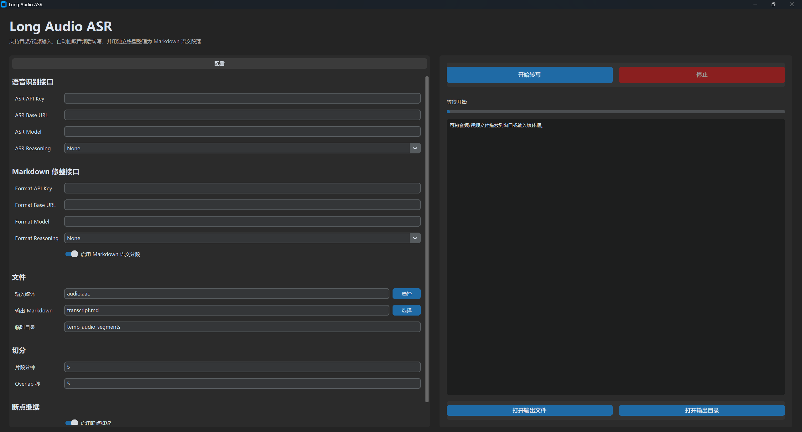

# Long Audio ASR

一个带 GUI 的长音频/视频 ASR 转写工具。它会把长媒体文件切成带 overlap 的音频片段，逐段调用多模态模型转写，再可选调用另一个文本模型将完整转写整理成 Markdown 语义段落。



## 功能

- 支持音频输入：`.aac`, `.mp3`, `.wav`, `.m4a`, `.flac`, `.ogg`
- 支持视频输入：`.mp4`, `.mkv`, `.mov`, `.avi`, `.webm`, `.flv`, `.wmv`, `.m4v`
- 视频会自动用 `ffmpeg` 抽取音频
- 相邻音频片段支持 overlap，降低切词风险
- ASR 模型和 Markdown 修整模型使用独立 API Key、Base URL 和模型名
- 输出 Markdown 文件
- 支持语义分段和标题整理
- 支持断点继续，尽量复用已完成的抽音频、切片、逐段转写和 Markdown 修整结果
- 支持拖拽导入音视频文件

## 安装

先确保系统已安装：

- Python 3.9+
- Git
- ffmpeg，并已加入 `PATH`

Windows 下可以直接运行：

```bat
install.bat
```

安装脚本会：

- 创建 `.venv`
- 升级 `pip`
- 安装 `requirements.txt` 中的依赖
- 检查 `ffmpeg` 是否可用

## 启动

双击：

```bat
run_gui.bat
```

或在 PowerShell 中运行：

```powershell
.\.venv\Scripts\python.exe asr_gui.py
```

命令行模式：

```powershell
.\.venv\Scripts\python.exe asr_transcriber.py
```

## 配置

GUI 会把配置保存到：

```text
asr_config.json
```

这个文件包含 API Key，已经被 `.gitignore` 忽略，不要提交到 Git。

主要配置项：

```json
{
  "asr_api_key": "",
  "asr_base_url": "",
  "asr_model": "gemini-3.1-pro-preview",
  "asr_reasoning_effort": "None",
  "format_api_key": "",
  "format_base_url": "",
  "format_model": "",
  "format_reasoning_effort": "None",
  "input_file": "audio.aac",
  "output_file": "transcript.md",
  "temp_dir": "temp_audio_segments",
  "segment_length_min": 5,
  "overlap_seconds": 5,
  "enable_markdown_format": true,
  "enable_resume": true,
  "clear_resume_cache": false
}
```

推荐模型使用 `gemini-3.1-pro-preview`，推荐片段长度为 `5` 分钟。较长片段可以减少分段数量和 overlap 重复，但太长会导致识别准确度下降。

## 断点继续

断点缓存默认放在：

```text
temp_audio_segments\.asr_state\
```

缓存分三层：

- `media`：复用视频抽音频和音频切片
- `asr`：复用每个片段的转写结果
- `format`：复用 Markdown 修整结果

如果中途中断，下次启动同一任务会自动复用已完成部分。GUI 中可以关闭“启用断点继续”，也可以勾选“清除本任务缓存后重新开始”。

## Git 和隐私

以下文件不会被提交：

- `.venv/`
- `asr_config.json`
- `temp_audio_segments/`
- 音频/视频文件
- 转写输出文件
- Python 缓存文件

提交前建议检查：

```powershell
git status --short
```

不要提交真实 API Key、原始音视频、切片缓存或转写结果。

## API 测试

测试 ASR 接口：

```powershell
.\.venv\Scripts\python.exe api_test.py asr
```

测试 Markdown 修整接口：

```powershell
.\.venv\Scripts\python.exe api_test.py format
```

不传参数时默认测试 `format`。
